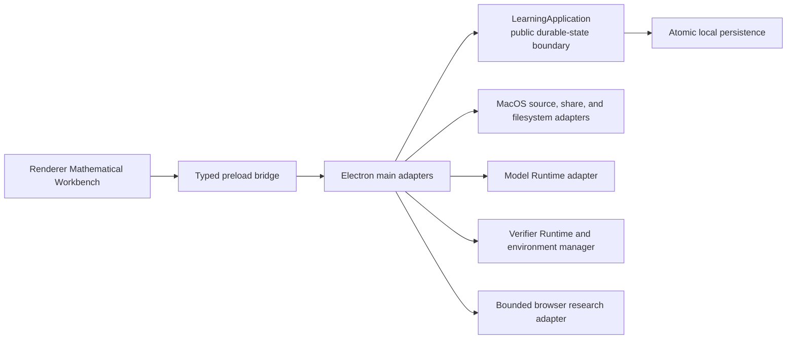

# Architecture guide

This is the canonical human-facing overview of Quick Study's stable runtime responsibilities and public engineering seams. It explains where a safe change belongs without replacing the domain glossary in [CONTEXT.md](../CONTEXT.md) or the decisions in [docs/adr/](adr/). The [development guide](development.md) owns setup and verification commands.

## System boundary

The renderer can request learner-visible state and actions through the typed preload API. The main process owns Electron capabilities and constructs the application with narrow adapters. The `LearningApplication` remains the public domain boundary for durable learner behavior; it does not expose Electron, Codex protocol, or native-helper details to the renderer.

## Responsibility map

| Area | Canonical responsibility | Safe-change seam |
| --- | --- | --- |
| `src/shared/learning-application.ts` | Durable Study Workspace, Study Mission, Learning Session, source, annotation, Teaching Move, Learning Artifact, Agent Task, evidence, and Verifier Environment state; lifecycle and learner-action coordination | Add or change product behavior through the typed `LearningApplication` / `LearnerAction` boundary and its deterministic tests |
| `src/shared/model-runtime.ts` | Provider-neutral Model Runtime contract and capability/event vocabulary | Change transport implementations behind the contract; do not persist Codex protocol shapes |
| `src/shared/external-research.ts` | Provider-neutral external-research request and receipt validation | Keep outbound context and returned evidence bounded and explicit |
| `src/shared/verifier-runtime.ts` | Formal-verification adapter contract and exact result vocabulary | Record formal status only from an accepted Verifier Runtime receipt |
| `src/main/main.ts` | Electron lifecycle, IPC registration, adapter composition, shutdown, and bounded process orchestration | Keep it a narrow adapter; validate IPC inputs and trusted senders at the boundary |
| `src/main/preload.ts` | Typed, minimal renderer bridge | Expose explicit operations only; do not pass arbitrary IPC channels or Node capabilities |
| `src/main/source-access.ts` and native helpers | macOS source selection, bookmark/access lifetime, and bounded extraction | Preserve external ownership of Linked Sources and contain filesystem/native work |
| `src/main/lean-environment-manager.ts` and `src/main/lean-verifier.ts` | Staged, validated, removable Verifier Environment lifecycle and bounded Lean execution | Never report readiness before integrity and reference-proof checks succeed |
| `src/main/codex-app-server.ts` | Codex App Server Model Runtime transport | Translate transport lifecycle and failures into the provider-neutral contract |
| `src/renderer/` | Mathematical Workbench views, transient view state, accessible controls, and learner-visible status | Use preload APIs and application state; do not duplicate persistence or orchestration rules |
| `tests/packaged-quick-study.spec.ts` | Packaged behavior across renderer, preload, main, filesystem, packaging, and relaunch | Reserve coverage for critical journeys and use accessible public controls |

## Durable state and persistence

`LearningApplication` owns the state transition and lifecycle invariants. It serializes learner actions and persists canonical application state atomically. Persisted-schema changes must provide migration or safe defaults and restoration coverage for launch, mutation, quit, and relaunch where relevant.

The canonical application state and the rebuildable `source-index.json` cache are separate. A Source Index may be cleared or rebuilt without changing a Linked Source, Source Anchor, or Learning Session. Linked Sources remain at learner-selected external paths; a Source Link Record and Source Fingerprint preserve identity and change detection, while a Source Snapshot exists only after an explicit learner request.

Agent Work Logs retain internal specialist messages and tool execution records. Session Records retain learner-relevant work. Useful partial learner-facing output may be checkpointed, but raw protocol events do not become learner-facing state.

## Trust and capability boundaries

- Renderer input, IPC payloads, model output, persisted data, URLs, and native-helper output are untrusted. Validate them at the boundary and fail closed on malformed or unadvertised values.
- The preload bridge uses context isolation and does not provide Node integration to the renderer. Main-process IPC checks the sender before handling privileged requests.
- Model access, external research, filesystem source access, native helpers, and formal verification are separate capabilities. Loss of model access does not disable local work.
- Model and browser work is bounded and cancellable. Cancellation, transport loss, shutdown, and relaunch must produce an honest terminal or resumable state; relaunch never silently restarts model spending.
- The Verifier Runtime may establish an exact formal receipt for the checked statement and assumptions. Model output, source agreement, and a failed checker are not formal verification or universal mathematical truth.
- macOS-specific facilities stay behind narrow adapters so shared state, persisted formats, and renderer behavior remain portable.

## Decision authorities

Use the domain glossary for canonical product terms and avoided synonyms. Use the relevant ADR for a settled architectural decision; in particular:

- [ADR-0002](adr/0002-build-macos-first-with-a-portable-electron-core.md) for the portable Electron core and macOS adapters.
- [ADR-0004](adr/0004-separate-agent-work-logs-from-learning-output.md) for Agent Work Logs and learner-facing output.
- [ADR-0007](adr/0007-treat-sources-as-evidence-not-ground-truth.md) for source provenance and uncertainty.
- [ADR-0017](adr/0017-link-disk-backed-sources-without-duplicating-them.md) for Linked Sources and external ownership.
- [ADR-0020](adr/0020-use-codex-app-server-as-the-version-one-model-runtime.md) for the Model Runtime boundary.
- [ADR-0021](adr/0021-ship-a-removable-lean-verifier-by-default.md) for the Verifier Environment.
- [ADR-0022](adr/0022-keep-local-work-available-without-model-access.md) and [ADR-0024](adr/0024-bound-agent-work-to-the-running-app.md) for local availability and bounded Agent Tasks.

If a proposed change contradicts an ADR or exposes a missing domain distinction, resolve that decision explicitly before introducing a parallel concept or boundary.

## Maintenance

The maintainer reviews this guide when a stable component responsibility, public seam, persistence invariant, trust boundary, runtime adapter, or relevant ADR changes. The guide should describe responsibility and routing, not copy implementation detail or the full domain glossary.
